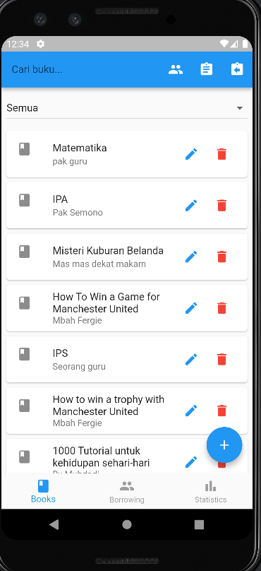
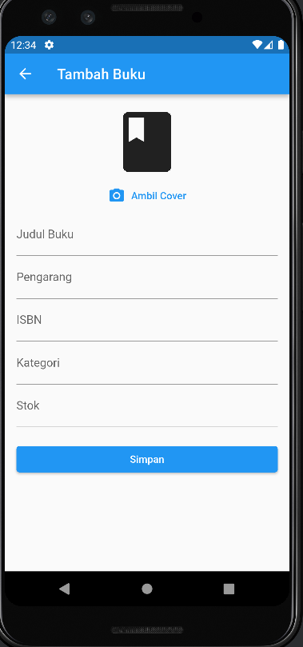
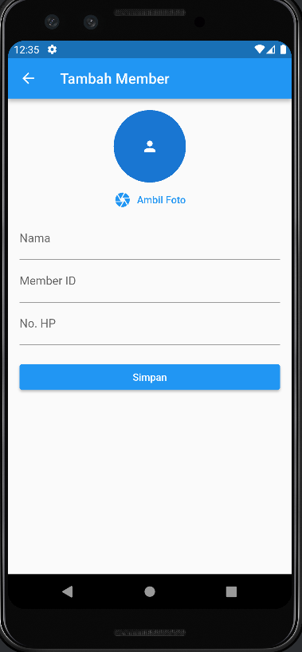
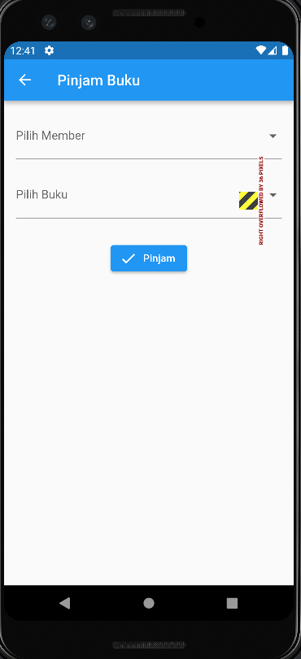
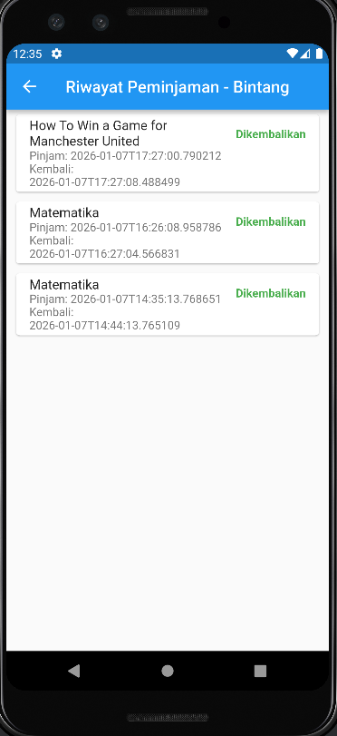
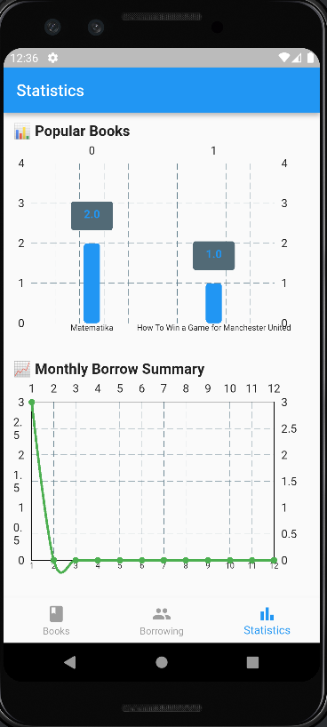

# 📚 PerpusKu – Mini Library Management App

PerpusKu adalah aplikasi **Mini Library Management System** berbasis **Flutter** yang dikembangkan sebagai **Final Capstone Project**. Aplikasi ini menyediakan fitur pengelolaan buku, peminjaman, dan statistik perpustakaan dengan penyimpanan data menggunakan **SQLite (local database)**.

---

## ✨ Fitur Utama

### 📘 Modul 1 – Book Catalog

* Menampilkan daftar buku
* Tambah buku baru (CRUD – Create)
* Edit data buku (Update)
* Hapus buku (Delete)
* Upload gambar cover buku (Camera / Gallery)
* Validasi input & error handling

### 👥 Modul 2 – Borrowing

* Manajemen data member
* Peminjaman buku
* Pengembalian buku
* Riwayat peminjaman
* Validasi status buku (tidak bisa dipinjam jika sedang dipinjam)

### 📊 Modul 3 – Statistics

* Statistik jumlah buku
* Statistik jumlah member
* Statistik total peminjaman
* Visualisasi data menggunakan **Chart**

---

## 🧱 Arsitektur Aplikasi

Aplikasi menggunakan **feature-based architecture** agar mudah dikembangkan dan terstruktur.

```
lib/
├── core/
│   └── database/
│       └── database_helper.dart
├── features/
│   ├── books/
│   │   ├── models/
│   │   └── screens/
│   ├── borrowing/
│   │   ├── models/
│   │   └── screens/
│   └── statistics/
        ├── helpers/
│       └── screens/
├── main.dart
```

---

## 🗄️ Database Schema (SQLite)

### 📕 Table: books

| Field      | Type         | Description     |
| ---------- | ------------ | --------------- |
| id         | INTEGER (PK) | ID Buku         |
| title      | TEXT         | Judul Buku      |
| author     | TEXT         | Penulis         |
| year       | INTEGER      | Tahun Terbit    |
| image      | TEXT         | Path gambar     |
| isBorrowed | INTEGER      | Status dipinjam |

### 👤 Table: members

| Field | Type         | Description |
| ----- | ------------ | ----------- |
| id    | INTEGER (PK) | ID Member   |
| name  | TEXT         | Nama Member |

### 🔄 Table: borrowings

| Field      | Type         | Description     |
| ---------- | ------------ | --------------- |
| id         | INTEGER (PK) | ID Peminjaman   |
| bookId     | INTEGER      | Relasi buku     |
| memberId   | INTEGER      | Relasi member   |
| borrowDate | TEXT         | Tanggal pinjam  |
| returnDate | TEXT         | Tanggal kembali |

---

## 📸 Screenshot Demo Aplikasi

## 📸 Screenshots

### Book Catalog



### Borrowing




### Statistics



---

## 🚀 Cara Menjalankan Aplikasi

### 1️⃣ Clone Repository

```bash
git clone https://github.com/WBINTANG/Final-capstone-project-submission.git
cd Final-capstone-project-submission
```

### 2️⃣ Install Dependencies

```bash
flutter pub get
```

### 3️⃣ Jalankan Aplikasi

```bash
flutter run
```

---

## 📦 Build APK / AAB (Opsional)

### Build APK

```bash
flutter build apk --release
```

### Build App Bundle

```bash
flutter build appbundle --release
```

---

## 🔗 Link Download

* 📦 APK / AAB: *(https://drive.google.com/drive/folders/1PvQYzQezHaxDl2_auZAl9nviGlhk1FGg?usp=sharing)*
* 🎥 Video Presentasi: *(link YouTube)*

---

## 🧠 Learning Outcomes

* Implementasi Flutter modular architecture
* CRUD operations dengan SQLite
* Local state management
* Error handling & validation
* Camera integration
* Data visualization menggunakan chart
* Debugging dependency & runtime error

---

## 👤 Author

**Nama**: Bintang W
**Project**: Final Capstone Project – Flutter (PerpusKu - Mini Library Management)

---

